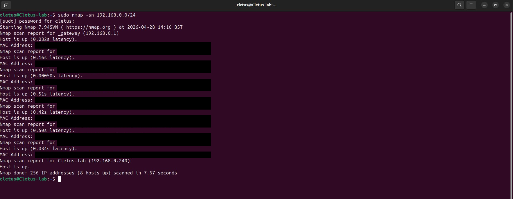
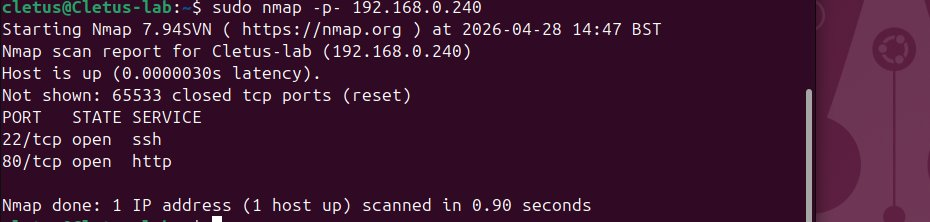
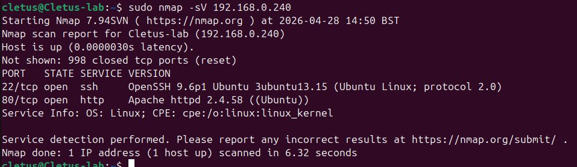
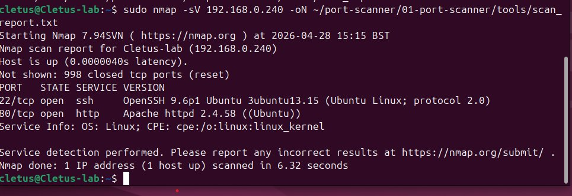

# 01 — Port Scanner

A port scanner checks which ports on a target machine are open and identifies what services are running on them. This project includes both a from-scratch Python implementation and a walkthrough of the same workflow using **Nmap**, the industry-standard tool.

---

## Why I Built This

I built this project to deepen my understanding of how networks and systems actually work. Port scanning is one of the most fundamental techniques in cyber security — it's the first step in almost every reconnaissance phase, and it relies on networking concepts (TCP, sockets, services, the three-way handshake) that every security professional needs to understand.

Rather than just running `nmap` from a tutorial, I wanted to build the tool from scratch in Python. Writing the socket code myself forced me to confront questions I would have skipped over otherwise: what does an open port actually look like to the operating system? Why does a closed port time out instead of failing instantly? How do you scan thousands of ports without waiting forever? Building it taught me far more than running it would have.

This is the first project in a portfolio aimed at building general cyber fundamentals — the hands-on networking and systems knowledge that underpins every specialist path in the field.

---

## What is a Port?

Every computer has 65,535 ports. Each port handles a specific type of network traffic:

- Port 22 → SSH (remote login)
- Port 80 → HTTP (websites)
- Port 443 → HTTPS (secure websites)
- Port 3306 → MySQL (database)

A port scanner knocks on each door and reports which ones are open.

---

## Lab Setup

All scans in this project were performed against a controlled lab environment that I built and own:

- **Lab machine:** Ubuntu Server VM (`Cletus-lab`) running on VMware
- **Network:** Isolated home lab segment (192.168.0.0/24)
- **Services exposed for testing:** SSH (port 22) via OpenSSH 9.6p1, HTTP (port 80) via Apache 2.4.58
- **Scanner host:** Ubuntu VM with Python 3 and Nmap 7.94SVN installed

No scans were performed against any system I do not own or have explicit permission to test.

---

## Versions

### Python Version (`python/`)

Built from scratch using only the Python standard library — no external packages required.

**Features**
- Multi-threaded TCP scanning (default 200 threads)
- Service detection
- Banner grabbing (reads the response a service returns on connection)
- JSON and HTML report output
- CLI interface using `argparse`

**Usage**

```bash
cd python/
python3 scanner.py 192.168.1.1
python3 scanner.py 192.168.1.1 -p 1-1024
python3 scanner.py 192.168.1.1 -p 1-65535 --threads 500
python3 scanner.py 192.168.1.1 -p 80,443,22 --output json
```

### Tools Version (`tools/`)

Using **Nmap** — the industry-standard port scanner used by security professionals worldwide.

See [`nmap_guide.md`](./nmap_guide.md) for the full walkthrough, flag-by-flag explanations, and findings.

---

## Example Output

### Nmap Reconnaissance Workflow

The screenshots below show the standard reconnaissance workflow against my lab VM, from initial discovery through to documenting the findings. This sequence — **discover → enumerate → fingerprint → document** — is the methodology used in real-world security assessments.

**1. Host Discovery (Ping Sweep)**

```bash
sudo nmap -sn 192.168.0.0/24
```



A network-wide ping sweep identifies live hosts on the local subnet. The gateway (192.168.0.1) and the target lab VM (192.168.0.240) are shown — other devices on the home network have been redacted to protect privacy.

**2. Full Port Scan**

```bash
sudo nmap -p- 192.168.0.240
```



Scans all 65,535 TCP ports on the target. Two ports are open — 22 (SSH) and 80 (HTTP) — and the other 65,533 are closed.

**3. Service Detection**

```bash
sudo nmap -sV 192.168.0.240
```



Probes the open ports to identify the service and version behind each one. SSH is **OpenSSH 9.6p1** on Ubuntu; HTTP is **Apache 2.4.58** on Ubuntu. This is the information a defender would use to check for known vulnerabilities, and it's also what an attacker would gather before targeting a host.

**4. Saving the Report**

```bash
sudo nmap -sV 192.168.0.240 -oN tools/scan_report.txt
```



The `-oN` flag writes the scan to a normal-format text file. Saving output is essential for documentation, audit trails, and comparison across scans over time.

### Python Scanner Output

> **TODO:** screenshot of `scanner.py` running against the lab VM, plus a screenshot of the generated HTML report. Add to `./python/screenshots/` and embed here.

---

## What I Learned

Building a port scanner from scratch turned what looked like a simple problem ("just connect to a port and see if it answers") into a series of more interesting ones:

- **TCP and the three-way handshake.** A port is *open* when the OS responds to a SYN packet with SYN-ACK. It's *closed* when it sends RST. It's *filtered* when nothing comes back at all. Writing socket code made me actually understand which of these I was relying on.
- **Why timeouts matter.** Closed ports time out instead of failing immediately, because the kernel waits to see if a delayed response is coming. Without an explicit timeout, scanning a single unresponsive port could hang for seconds. This is why setting `socket.settimeout()` aggressively is one of the first things any scanner has to do.
- **Threading vs. serial scanning.** Naively scanning all 65,535 ports one at a time would take a long time. Threading lets the scanner have hundreds of TCP connections in flight at once, which is why my Python version can complete a full scan in seconds rather than hours.
- **Banner grabbing.** Once a port is open, sending a small probe and reading the response often reveals the service and version. This is what nmap's `-sV` flag does professionally — building a basic version myself made me understand what services like SSH or HTTP actually "say" when you connect.
- **Output is half the tool.** Raw scan results are noisy. Writing JSON and HTML output taught me that the reporting layer is half of any security tool — finding the data is one thing; presenting it usefully is the other half.

---

## Limitations & Next Steps

This scanner is intentionally simple and has known limitations:

- **TCP only.** No UDP scanning. Many services (DNS, NTP, SNMP) run on UDP and would be missed.
- **No stealth techniques.** The scanner uses full TCP connect calls, which are easy to detect and log. Real scanners often use SYN scanning to avoid completing the handshake.
- **No OS fingerprinting.** Nmap can guess the operating system from subtle TCP behaviour. This scanner cannot.
- **Single-target only.** No subnet sweep — that's a separate tool entirely.

These limitations are precisely what makes Nmap a decades-old project maintained by thousands of contributors, and this a learning exercise. The point of building from scratch wasn't to compete with Nmap; it was to understand what's happening under the hood when Nmap runs.

Possible future improvements: SYN scanning via raw sockets, UDP support, optional stealth/timing controls, and a small subnet-sweep mode.

---

## Legal Notice

This tool is built for **educational purposes** and **authorised security testing only**.

Only scan systems you own or have explicit written permission to test. Unauthorised scanning of systems is illegal under the Computer Misuse Act 1990 (UK) and equivalent laws in most jurisdictions.
