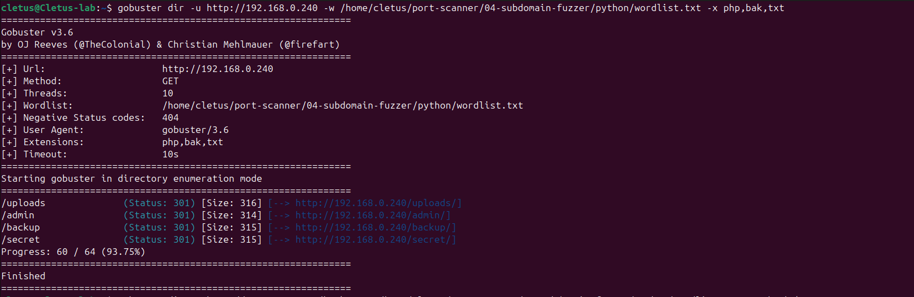
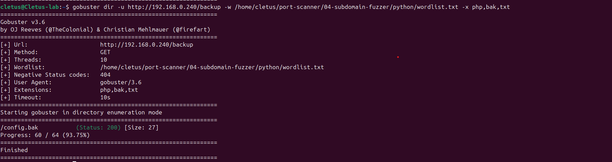

# Web Content Discovery with Gobuster

## Objective

Use Gobuster to discover hidden directories and sensitive files on a web server through directory fuzzing.

## Environment

- **Machine:** Cletus-lab (Ubuntu VM)
- **Target IP:** 192.168.0.240
- **Service:** Apache HTTP Server (port 80)
- **Tool:** Gobuster v3.6

> **Legal note:** Only perform content discovery against web servers you own or have explicit written permission to test.

---

## What is Directory Fuzzing?

Web servers often have directories and files that are never linked from the main page — left behind by developers, forgotten, or misconfigured. Examples include:

- `/admin` — admin panels
- `/backup` — backup files containing sensitive data
- `/uploads` — file upload directories
- `config.bak` — configuration files with credentials

A fuzzer tries thousands of common names automatically and reports which ones exist based on the HTTP response code.

---

## Step 1 — Set Up the Lab

Create hidden directories and files on the target to simulate a real misconfigured web server:

```bash
sudo mkdir -p /var/www/html/admin
sudo mkdir -p /var/www/html/backup
sudo mkdir -p /var/www/html/uploads
sudo mkdir -p /var/www/html/secret
echo "DB_PASSWORD=supersecret123" | sudo tee /var/www/html/backup/config.bak
```

---

## Step 2 — Scan the Root Directory

```bash
gobuster dir -u http://192.168.0.240 -w wordlist.txt -x php,bak,txt
```

### Flags explained

| Flag | Meaning |
|------|---------|
| `dir` | Directory enumeration mode |
| `-u` | Target URL |
| `-w` | Wordlist file |
| `-x` | File extensions to check |

### Output

```
/admin       (Status: 301) [--> http://192.168.0.240/admin/]
/secret      (Status: 301) [--> http://192.168.0.240/secret/]
/uploads     (Status: 301) [--> http://192.168.0.240/uploads/]
/backup      (Status: 301) [--> http://192.168.0.240/backup/]
```

All 4 hidden directories discovered. The 301 redirects confirm they exist — Apache redirects `/backup` to `/backup/`.



---

## Step 3 — Dig Into a Discovered Directory

Once a directory is found, fuzz inside it to find hidden files:

```bash
gobuster dir -u http://192.168.0.240/backup -w wordlist.txt -x php,bak,txt
```

### Output

```
/config.bak  (Status: 200) [Size: 27]
```

`config.bak` found with a 200 OK — the file is publicly accessible. It contains:

```
DB_PASSWORD=supersecret123
```

A real attacker could use these credentials to access the database directly.



---

## HTTP Response Codes — What They Mean

| Code | Meaning | Action |
|------|---------|--------|
| 200 | File exists and is accessible | Investigate immediately |
| 301/302 | Directory exists (redirect) | Fuzz inside it |
| 403 | Exists but access denied | Note it — may be bypassable |
| 404 | Not found | Skip |

---

## Key Gobuster Flags Reference

| Flag | Description |
|------|-------------|
| `-u` | Target URL |
| `-w` | Wordlist file |
| `-x` | File extensions |
| `-t` | Number of threads (default: 10) |
| `-o` | Save output to file |
| `-s` | Only show specific status codes |
| `-b` | Exclude specific status codes |
| `--timeout` | Request timeout |

---

## Defensive Takeaways

- **Remove backup and config files** from web-accessible directories
- **Disable directory listing** in Apache (`Options -Indexes`)
- **Use `.htaccess`** to block access to sensitive file types (`.bak`, `.env`, `.sql`)
- **Regular audits** — run Gobuster against your own servers to find exposures before attackers do
