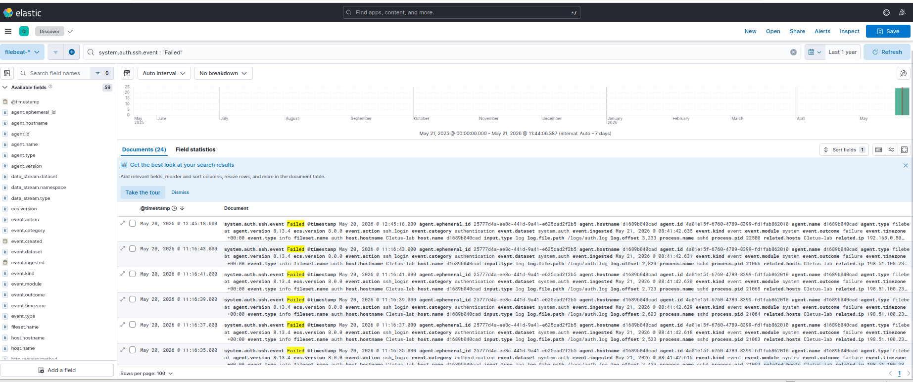
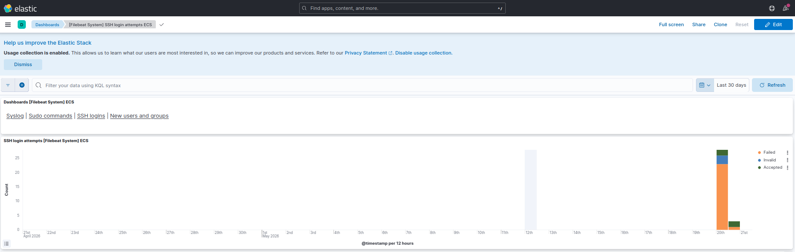
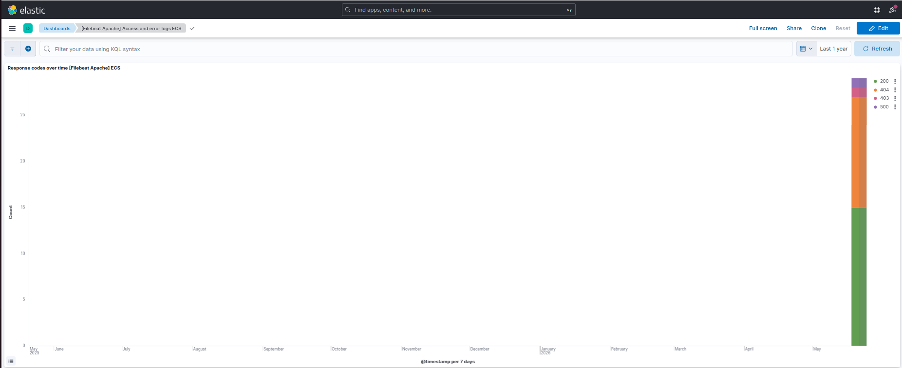

# Log Analysis with the ELK Stack (Elasticsearch · Logstash · Kibana)

This walkthrough takes the same logs the Python analyzer parses and feeds them
into the **ELK stack** — the industry-standard platform for centralised log
analysis and SIEM-style dashboards. The goal is to detect the same attacks
(SSH brute force, web scanning, SQLi/XSS probes) visually and at scale.

> **Lab:** Cletus-lab (Ubuntu VM, `192.168.0.240`). All work is on systems I own.
> Screenshots live in `screenshots/`.

---

## Why ELK over a script?

The Python tool is great for a single file. ELK is what teams actually run in
production: it ingests logs from many hosts in real time, stores them in a
searchable index, and lets you pivot/visualise without re-parsing. This project
shows I can do both — build the detection logic *and* operate the enterprise tool.

---

## Step 0 — Bring up the stack

The whole lab is defined in [`docker-compose.yml`](docker-compose.yml):
single-node Elasticsearch + Kibana + Filebeat, all on the official 8.13.4
images. From the `tools/` folder on the VM:

```bash
docker compose up -d
```

Verify Elasticsearch is up:

```bash
curl http://localhost:9200
```

Open Kibana at `http://192.168.0.240:5601`.

> Warning: the compose file sets `xpack.security.enabled=false`. That is **lab-only**
> — it makes the cluster open with no auth. Never do this on a real cluster.

---

## Step 1 — Ship the logs with Filebeat

Filebeat tails log files and ships them to Elasticsearch. Its built-in modules
already know how to parse SSH `auth.log` and Apache access logs, so there's no
hand-written parser. The config lives in [`filebeat.yml`](filebeat.yml): it
enables the **system** (auth) and **apache** (access) modules and points their
`var.paths` at the sample logs, which the compose file mounts read-only at
`/logs`.

The long-running Filebeat from `up -d` ships the logs continuously. Run this
one-off `setup` to load the index template, ingest pipelines, and the module
dashboards into Kibana:

```bash
docker compose run --rm filebeat filebeat setup -e --strict.perms=false
```

> Note: the `--strict.perms=false` flag matters: Filebeat refuses a config file
> that isn't owned by root, and the mounted `filebeat.yml` is owned by the host
> user. The flag (also baked into the compose `command:`) tells it to relax that
> check — fine for a lab.

The `system` module parses `auth.log` (SSH events); `apache` parses the access
log. After a few seconds the documents appear under the `filebeat-*` data view —
62 events from the two sample logs in this run.

---

## Step 2 — Explore in Kibana Discover

In **Discover**, select the `filebeat-*` data view. Each log line is now a
structured document with fields like `source.ip`, `user.name`,
`system.auth.ssh.event`, `http.response.status_code`, and `user_agent.original`.

Filtering on `system.auth.ssh.event : "Failed"` returns **24 failed SSH logins** —
12 from `198.51.100.23`, 11 from `203.0.113.66`, and a single one from
`192.168.0.50` (a legitimate user mistyping a password). The two outside IPs
drowning out the one normal failure is the brute-force pattern at a glance.



Useful KQL queries:

```text
# SSH failed logins
system.auth.ssh.event : "Failed"

# Brute force from a single IP
system.auth.ssh.event : "Failed" and source.ip : "198.51.100.23"

# Web requests that 404'd (scanning)
http.response.status_code : 404

# Known attack tools by user agent
user_agent.original : (*sqlmap* or *gobuster* or *nikto*)
```

---

## Step 3 — Visualise in the module dashboards

A nice payoff of using Filebeat modules: `filebeat setup` loads ready-made
Kibana dashboards, so the attacks are visible without building a single chart by
hand. Two of them tell the whole story.

**`[Filebeat System] SSH login attempts`** — a stacked bar chart by outcome. The
entire dataset collapses into one spike on 20 May: a tall block of **Failed**
(orange) topped with **Invalid** user attempts (blue) — the enumeration of
usernames like `oracle`, `jenkins`, `postgres` — and only a sliver of
**Accepted** (green). Every other day is empty. That lopsided bar *is* the
brute-force signature.



**`[Filebeat Apache] Access and error logs`** — the *Response codes over time*
panel shows mostly **200**s (green, normal page loads) plus a clear band of
**404**s (orange) from the directory scan probing paths that don't exist, with
small slices of **403** (a blocked path-traversal attempt) and **500** (the
SQLi error). A healthy site is almost all 200s; that 404 band is the scan.



---

## Step 4 — Detection rule / alert (next step)

Viewing dashboards is reactive. The production move is to promote the
brute-force query to an **alert**: under **Stack Management → Rules**, trigger
when `system.auth.ssh.event : "Failed"` exceeds, say, 10 events from one
`source.ip` inside 5 minutes, and fire an email/webhook. That's the same logic
as the Python analyzer's `--threshold`, but evaluated continuously across every
host shipping to the cluster rather than one file at a time.

---

## Findings — same attacks, two tools

| Attack | Python analyzer | ELK / Kibana |
|--------|-----------------|--------------|
| SSH brute force | failed-attempt threshold per IP | stacked bar chart (failed/invalid/accepted) |
| Username enumeration | invalid-user tracking | "Invalid" band on the SSH dashboard |
| Web content scanning | 404 flood per IP | response-code time chart (404 band) |
| SQLi / XSS / traversal | regex signatures | `url.path` + status-code KQL |
| Scanner tooling | user-agent match | `user_agent.original` KQL |

## Takeaways

- ELK turns raw text logs into a queryable, visual dataset — the foundation of
  any SOC.
- Filebeat modules mean you rarely write parsers by hand in production.
- The detections mirror the from-scratch Python tool, proving the concepts
  transfer from a script to enterprise tooling.
