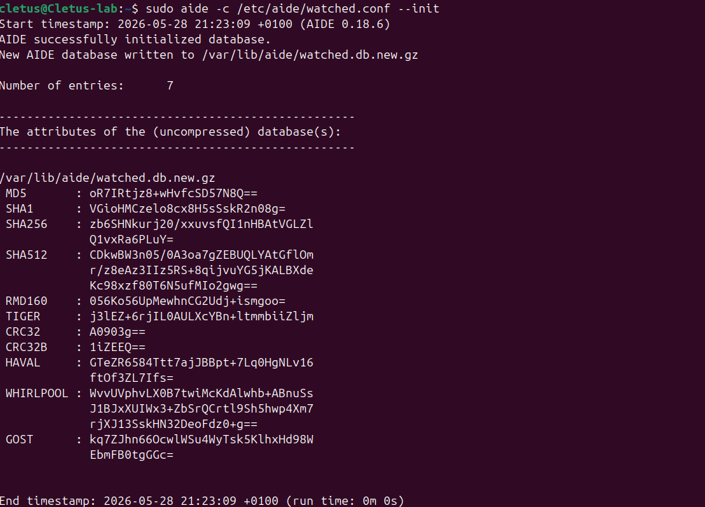
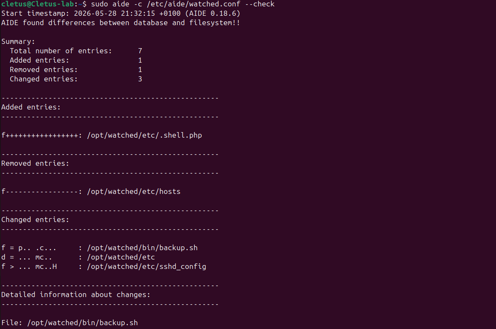

# File Integrity Monitoring with AIDE

**AIDE** (Advanced Intrusion Detection Environment) is the default file
integrity monitor on Debian/Ubuntu and RHEL. It builds a database of file
hashes and attributes, then compares the live filesystem against it on demand.
It maps almost 1:1 onto the from-scratch Python tool: `aideinit` is
`fim.py baseline`, and `aide --check` is `fim.py check`.

> **Lab:** Cletus-lab (Ubuntu VM, `192.168.0.240`). All work is on a system I own.

---

## Why AIDE over a script?

`fim.py` proves I understand the mechanics — walk the tree, hash each file,
diff against a saved snapshot. AIDE is what you actually deploy: a mature rule
language for choosing *which* attributes matter per path (you care about the
hash of a binary, but only the size/mtime of a log), gzip-compressed databases,
and a config model that scales from one host to a fleet via config management.

---

## Step 0 — Install

```bash
sudo apt update && sudo apt install -y aide aide-common
aide --version
```

To keep the demo parallel with the Python tool, I monitor a small test tree
that mirrors `samples/watched/` rather than all of `/etc`:

```bash
sudo mkdir -p /opt/watched/etc /opt/watched/bin
sudo cp samples/watched/etc/* /opt/watched/etc/
sudo cp samples/watched/bin/* /opt/watched/bin/
```

---

## Step 1 — Write a minimal config

AIDE rules are macros that select which attributes to track. I define one
`FULL` rule — permissions, inode, link count, user, group, size, mtime, ctime
and a SHA-256 hash — and apply it to the watched tree. Saved as
`/etc/aide/watched.conf`:

```text
database_in=file:/var/lib/aide/watched.db.gz
database_out=file:/var/lib/aide/watched.db.new.gz
gzip_dbout=yes

# p=perms i=inode n=links u=user g=group s=size m=mtime c=ctime + hash
FULL = p+i+n+u+g+s+m+c+sha256

/opt/watched FULL
```

The `c` (ctime) and `p` (permissions) selectors are what let AIDE catch a
`chmod` even when file contents are untouched — the same "Permissions Changed"
finding the Python tool emits.

---

## Step 2 — Initialise the database (the baseline)

```bash
sudo aide -c /etc/aide/watched.conf --init
# AIDE writes the new DB to the *.new path; promote it to the active DB:
sudo mv /var/lib/aide/watched.db.new.gz /var/lib/aide/watched.db.gz
```



This is the trusted snapshot. In production you'd store it off-host (or sign it)
so an attacker who roots the box can't quietly rewrite the baseline.

---

## Step 3 — Simulate a compromise

The same four changes used in the Python demo:

```bash
# Modify: re-enable root SSH login
sudo sed -i 's/PermitRootLogin no/PermitRootLogin yes/' /opt/watched/etc/sshd_config
# Add: drop a web shell
echo '<?php system($_GET["c"]); ?>' | sudo tee /opt/watched/etc/.shell.php
# Delete: remove the hosts file
sudo rm /opt/watched/etc/hosts
# Permissions: make the backup script world-writable
sudo chmod 777 /opt/watched/bin/backup.sh
```

---

## Step 4 — Run the integrity check

```bash
sudo aide -c /etc/aide/watched.conf --check
```

AIDE exits non-zero and prints a summary plus per-file detail — the added web
shell, the removed hosts file, the changed config hash, and the permission flip:

```text
AIDE found differences between database and filesystem!!

Summary:
  Total number of entries:  4
  Added entries:            1
  Removed entries:          1
  Changed entries:          2

Added entries:
f++++++++++++++++: /opt/watched/etc/.shell.php

Removed entries:
f----------------: /opt/watched/etc/hosts

Changed entries:
f ...    .C...  : /opt/watched/etc/sshd_config
f ...p...   .  : /opt/watched/bin/backup.sh

Detailed information about changes:
File: /opt/watched/etc/sshd_config
 SHA256   : 02Yr...old...   | 7HhP...new...

File: /opt/watched/bin/backup.sh
 Perm     : -rw-rw-r--      | -rwxrwxrwx
```



In the change flags, `C` marks a content/hash change and `p` a permission
change — exactly the **Modified** and **Permissions Changed** categories the
Python tool reports.

---

## Step 5 — Accept legitimate changes & schedule

After a *legitimate* change (a real config edit), fold it into the baseline so
it stops alerting:

```bash
sudo aide -c /etc/aide/watched.conf --update
sudo mv /var/lib/aide/watched.db.new.gz /var/lib/aide/watched.db.gz
```

`aide-common` already installs a daily cron job (`/etc/cron.daily/aide`) that
checks the system database and emails root the report. That's the production
pattern: a trusted baseline plus an automated daily diff.

---

## Findings — AIDE vs. the Python tool

| Change | `fim.py` | AIDE |
|--------|----------|------|
| Contents changed | Modified (Critical) | `C` flag + SHA256 old/new |
| New file | Added (High) | `f+++…` under *Added entries* |
| Missing file | Deleted (High) | `f---…` under *Removed entries* |
| Permissions changed | Permissions Changed (Medium) | `p` flag + Perm old/new |
| Clean run exit code | `0` | `0` (non-zero when differences found) |
