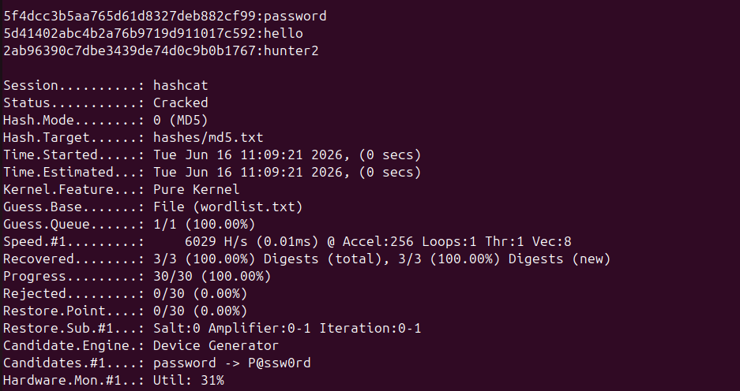
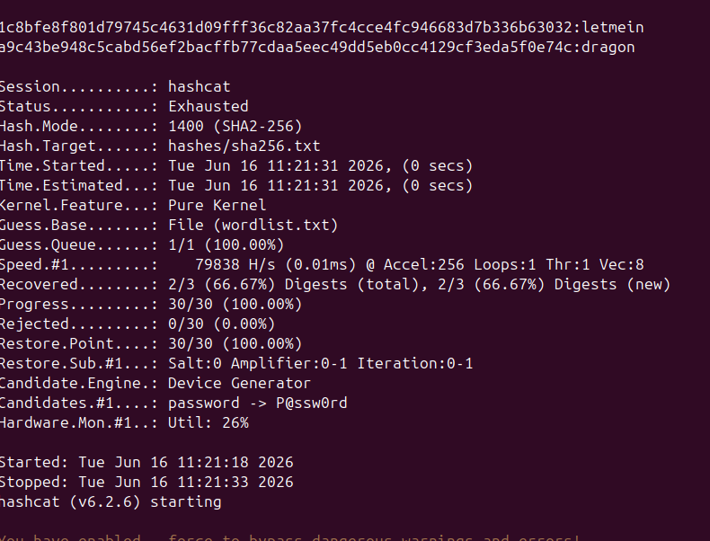
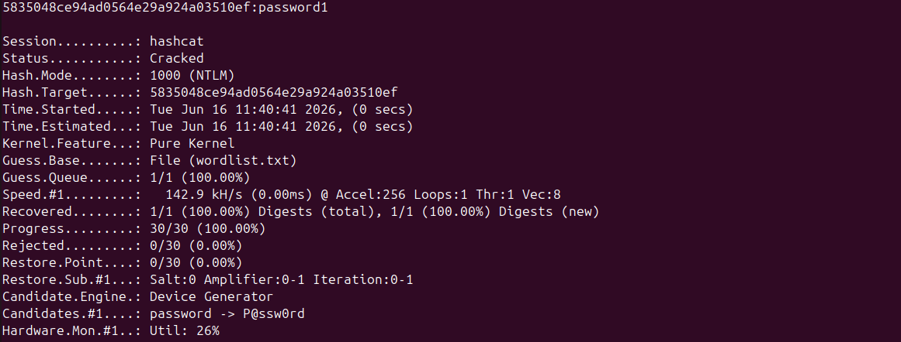
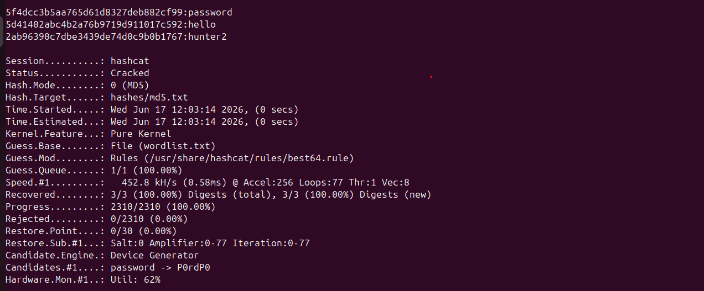
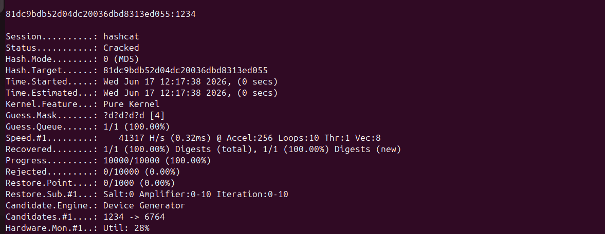
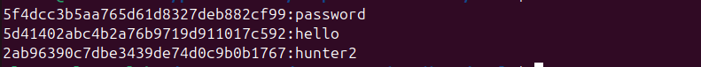

# Password Cracking with Hashcat

## Objective

Use Hashcat to recover plaintext passwords from hashes — by dictionary attack,
by mutating a wordlist with rules, and by mask (brute-force) attack — across
several hash algorithms (MD5, SHA-1, SHA-256, SHA-512, NTLM). This is the
tools-version counterpart to the from-scratch `auditor.py crack` command.

## Environment

- **Machine:** Cletus-lab (Ubuntu VM)
- **Tool:** Hashcat v6.2.6
- **Inputs:** sample hash files in `hashes/`, demo `wordlist.txt`
- **Working directory:** `08-password-auditor/tools`

> **Legal note:** Only crack hashes you own or are authorised to test. Every hash
> in `hashes/` is of a throwaway demo password I generated myself — there are no
> real credentials here.

> **CPU note:** This VM has no dedicated GPU, so the examples add `--force` to let
> Hashcat run on the CPU. On a real cracking rig you drop `--force` and speeds jump
> from tens of thousands to billions of hashes per second.

---

## Step 0 — Verify Hashcat

```bash
hashcat --version
```

If it is not installed:

```bash
sudo apt update && sudo apt install -y hashcat
```

---

## Step 1 — Know Your Hash Mode

Hashcat selects the algorithm with `-m` (hash mode), a number rather than a name.
You have to know what you are cracking first — this is exactly what
`auditor.py identify` is for. The modes used in this lab:

| Algorithm | `-m` mode | Sample file |
|-----------|-----------|-------------|
| MD5       | `0`       | `hashes/md5.txt` |
| SHA-1     | `100`     | `hashes/sha1.txt` |
| SHA-256   | `1400`    | `hashes/sha256.txt` |
| SHA-512   | `1700`    | `hashes/sha512.txt` |
| NTLM      | `1000`    | `hashes/ntlm.txt` |

List every supported mode with `hashcat --help | less`.

---

## Step 2 — Dictionary Attack (MD5)

The bread-and-butter attack: hash every word in a list and compare. This is
attack mode `-a 0`.

### Command

```bash
hashcat -m 0 -a 0 hashes/md5.txt wordlist.txt --force
```

### Flags explained

| Flag | Meaning |
|------|---------|
| `-m 0` | Hash type is MD5 |
| `-a 0` | Attack mode 0 — straight dictionary |
| `hashes/md5.txt` | File of target hashes (one per line) |
| `wordlist.txt` | Candidate passwords to try |
| `--force` | Run on CPU (no GPU in this VM) |

### Output

```
5f4dcc3b5aa765d61d8327deb882cf99:password
5d41402abc4b2a76b9719d911017c592:hello
2ab96390c7dbe3439de74d0c9b0b1767:hunter2

Session..........: hashcat
Status...........: Cracked
Hash.Mode........: 0 (MD5)
Hash.Target......: hashes/md5.txt
Guess.Base.......: File (wordlist.txt)
Speed.#1.........:    45767 H/s
Recovered........: 3/3 (100.00%) Digests
Progress.........: 30/30 (100.00%)
```

All three MD5 hashes fell to the 30-word list. Hashcat appends each result as
`hash:plaintext`.



---

## Step 3 — Same Attack, Other Algorithms

Only the mode number changes. The from-scratch tool needed a separate code path
per algorithm; Hashcat just swaps `-m`.

```bash
# SHA-1  -> cracks "admin" and "qwerty"
hashcat -m 100 -a 0 hashes/sha1.txt wordlist.txt --force

# SHA-256 -> cracks "letmein" and "dragon"; one hash stays uncracked
hashcat -m 1400 -a 0 hashes/sha256.txt wordlist.txt --force

# SHA-512 -> cracks "monkey"
hashcat -m 1700 -a 0 hashes/sha512.txt wordlist.txt --force
```

The third SHA-256 hash is **not** in the wordlist, so Hashcat reports
`Status: Exhausted` for it — a realistic outcome that shows a dictionary attack
only finds passwords the list already contains.



---

## Step 4 — Crack an NTLM Hash

NTLM is what Windows stores for local accounts (and what you dump from a domain
controller). Mode `1000`.

### Command

```bash
hashcat -m 1000 -a 0 hashes/ntlm.txt wordlist.txt --force
```

### Output

```
5835048ce94ad0564e29a924a03510ef:password1

Status...........: Cracked
Hash.Mode........: 1000 (NTLM)
Recovered........: 1/1 (100.00%) Digests
```

This is the same hash the Python tool cracks with `--type ntlm`, recovering
`password1`.



---

## Step 5 — Stretch the Wordlist with Rules

Real attackers rarely run a raw list — they apply **rules** that mutate each word
(capitalise, append digits, leetspeak). One small list becomes thousands of
variants. `best64.rule` ships with Hashcat.

### Command

```bash
hashcat -m 0 -a 0 hashes/md5.txt wordlist.txt -r /usr/share/hashcat/rules/best64.rule --force
```

This turns `password` into `Password`, `password1`, `p@ssword`, `password!`, and
~60 more per word — the kind of mutation that catches "I made my password
'complex' by adding a 1 at the end" passwords.



---

## Step 6 — Mask (Brute-Force) Attack

When no wordlist works, fall back to brute force. Hashcat calls this a **mask
attack** (`-a 3`): you describe the candidate shape with placeholders instead of
listing words. This mirrors `auditor.py crack --brute`.

`hashes/pin.txt` holds the MD5 of a 4-digit PIN. The mask `?d?d?d?d` means "four
digits", a keyspace of only 10,000 — instant.

### Command

```bash
hashcat -m 0 -a 3 hashes/pin.txt ?d?d?d?d --force
```

### Mask placeholders

| Token | Charset |
|-------|---------|
| `?l` | a-z |
| `?u` | A-Z |
| `?d` | 0-9 |
| `?s` | symbols |
| `?a` | all of the above |

### Output

```
81dc9bdb52d04dc20036dbd8313ed055:1234

Status...........: Cracked
```

Add one character to the mask and the keyspace grows by its charset size —
`?d?d?d?d?d?d?d?d` (8 digits) is 100 million candidates. Add a lowercase letter
(`?l`) and it explodes far faster. This is *why* length and character variety
matter, and it's the entropy math the `auditor.py score` command reports.



---

## Step 7 — Read the Results Back

Hashcat stores every cracked hash in a **potfile** (`~/.hashcat/hashcat.potfile`)
so it never re-cracks the same hash. To reprint results without re-running:

```bash
hashcat -m 0 hashes/md5.txt --show
```

```
5f4dcc3b5aa765d61d8327deb882cf99:password
5d41402abc4b2a76b9719d911017c592:hello
2ab96390c7dbe3439de74d0c9b0b1767:hunter2
```



---

## Hashcat Flags Reference

| Flag | Description |
|------|-------------|
| `-m` | Hash mode (algorithm) |
| `-a` | Attack mode: `0` dictionary, `1` combinator, `3` mask, `6`/`7` hybrid |
| `-r` | Apply a rules file to mutate candidates |
| `--show` | Print already-cracked hashes from the potfile |
| `--username` | Hash file has `user:hash` format — strip the username |
| `-o file` | Write cracked results to a file |
| `--force` | Ignore warnings / run on CPU |
| `--increment` | Mask attack: try increasing lengths automatically |

---

## Defensive Takeaways

This lab is the attacker's view; the lesson is how to make their job impossible:

- **Use slow hashes for storage.** MD5/SHA cracked at thousands–billions per
  second. **bcrypt**, **scrypt**, and **Argon2** are deliberately slow and salted,
  turning a seconds-long crack into years. Never store passwords as raw MD5/SHA.
- **Length beats complexity.** The mask demo shows keyspace grows with every added
  character. A long passphrase defeats brute force far better than `P@ssw0rd!`.
- **Rules eat predictable patterns.** `best64` instantly tries `Password1!`. If
  your "strong" password is a dictionary word with a tweak, it's already on a list.
- **Salt every hash.** Salts make precomputed (rainbow-table) attacks useless and
  force the attacker to crack each hash individually.
- **Enforce against breach lists.** Reject passwords that appear in known dumps —
  the same idea as the `auditor.py score` common-password check.
