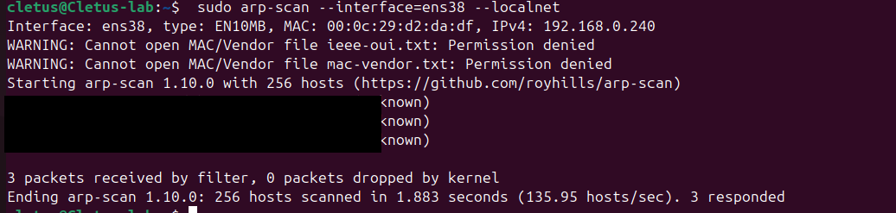
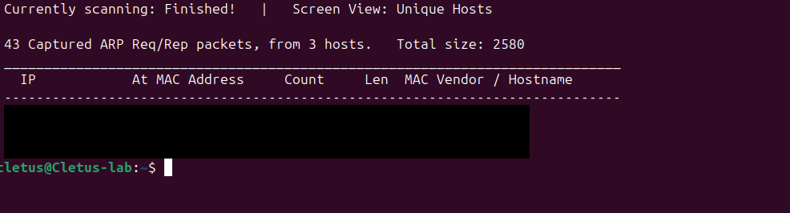
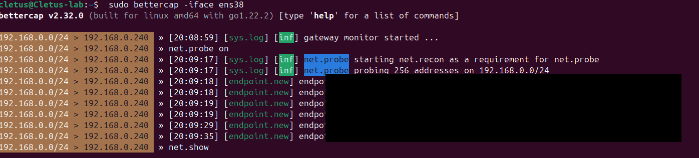

# Network Mapping & ARP Spoofing with Industry Tools

## Objective

Map a local network at layer 2 with `arp-scan`, `netdiscover`, and
`bettercap`, then explain how ARP cache poisoning turns that map into a
man-in-the-middle attack — and how to detect it. This is the tools-version
counterpart to the from-scratch `netmapper.py` and `arpspoof.py`.

## Environment

- **Machine:** Cletus-lab (Ubuntu VM)
- **Interface:** `ens38` (home network)
- **Subnet:** `192.168.0.0/24`

> **Legal & ethics note:** Mapping below is run against my own lab subnet only;
> other people's devices are redacted in the screenshots. ARP spoofing is
> **explained but not executed** against any real device — poisoning a network
> you do not own is illegal.

> **Root note:** ARP tools send raw frames, so each command uses `sudo`.

---

## Step 0 — Identify the Interface

```bash
ip -brief address
ip route | grep default
```

Note the interface on the home network (`ens38`) and the gateway IP — that is
what you map and, conceptually, what an attacker would spoof.

---

## Step 1 — ARP Sweep with arp-scan

Install and sweep the local subnet:

```bash
sudo apt install -y arp-scan
sudo arp-scan --interface=ens38 --localnet
```

`arp-scan` broadcasts an ARP request for every address on the segment and
prints each host that answers with its IP, MAC, and vendor — the same technique
as `netmapper.py`, but with a full IEEE OUI database built in.

```
192.168.0.1     xx:xx:xx:xx:xx:xx   (gateway, redacted)
192.168.0.240   00:0c:29:xx:xx:xx   VMware, Inc.
```



---

## Step 2 — Discovery with netdiscover

```bash
sudo apt install -y netdiscover
sudo netdiscover -i ens38 -r 192.168.0.0/24
```

`netdiscover` shows the same hosts in a live-updating table and can also run
**passively** (`-p`) — just listening to ARP traffic without sending anything,
which is stealthier.



---

## Step 3 — Map with bettercap

`bettercap` is the modern recon/MITM framework. Its `net.probe` module actively
maps the subnet; `net.show` prints the host table.

```bash
sudo apt install -y bettercap
sudo bettercap -iface ens38
```

At the interactive prompt:

```
net.probe on
net.show
```

`net.probe` actively walks the subnet and logs each host as it is found
(`endpoint.new`); `net.show` then prints the full host table with IP, MAC,
vendor, and which host is the gateway. In the screenshot below the discovered
hosts' IP/MAC details are redacted — only the lab VM's own activity is left
visible.



---

## Step 4 — How ARP Spoofing Works (explained, not executed)

Once the map exists, an attacker poisons two caches to sit in the middle. In
bettercap that is a single module:

```
# NOT run in this lab — shown to explain the mechanism
set arp.spoof.targets 192.168.0.50
arp.spoof on
net.sniff on
```

What those commands would do:

1. `arp.spoof` sends forged ARP replies telling the **victim** that the
   attacker's MAC owns the **gateway** IP, and telling the **gateway** that the
   attacker owns the **victim** IP.
2. Both sides update their ARP caches and start sending frames to the attacker.
3. With IP forwarding on, the attacker relays traffic so nothing breaks — a
   transparent man-in-the-middle. `net.sniff` then reads everything unencrypted.

This is exactly what `arpspoof.py --live --forward` automates from scratch. In
this lab it is left as a dry-run / explanation only.

---

## Step 5 — Detecting & Defending

The poison packets are noisy and detectable:

```bash
# A host's gateway suddenly sharing a MAC with another IP = poisoning
arp -n

# arpwatch logs every MAC<->IP change and emails on "flip flop"
sudo apt install -y arpwatch
sudo arpwatch -i ens38
```

Defences:

- **Dynamic ARP Inspection (DAI)** on managed switches drops forged replies.
- **Static ARP entries** for the gateway on critical hosts.
- **Encrypt in transit** (TLS/SSH) so a MITM only sees ciphertext.
- **Monitor for duplicate MACs / rapid ARP flips** with `arpwatch` or an IDS.

---

## Tool Reference

| Command | Description |
|---------|-------------|
| `arp-scan --localnet` | ARP-sweep the local subnet |
| `netdiscover -p` | Passive ARP discovery (sends nothing) |
| `bettercap` → `net.probe` | Active host mapping |
| `bettercap` → `arp.spoof` | ARP MITM (not used here) |
| `arpwatch` | Log/alert on MAC↔IP changes |
| `arp -n` | Show the local ARP cache |
